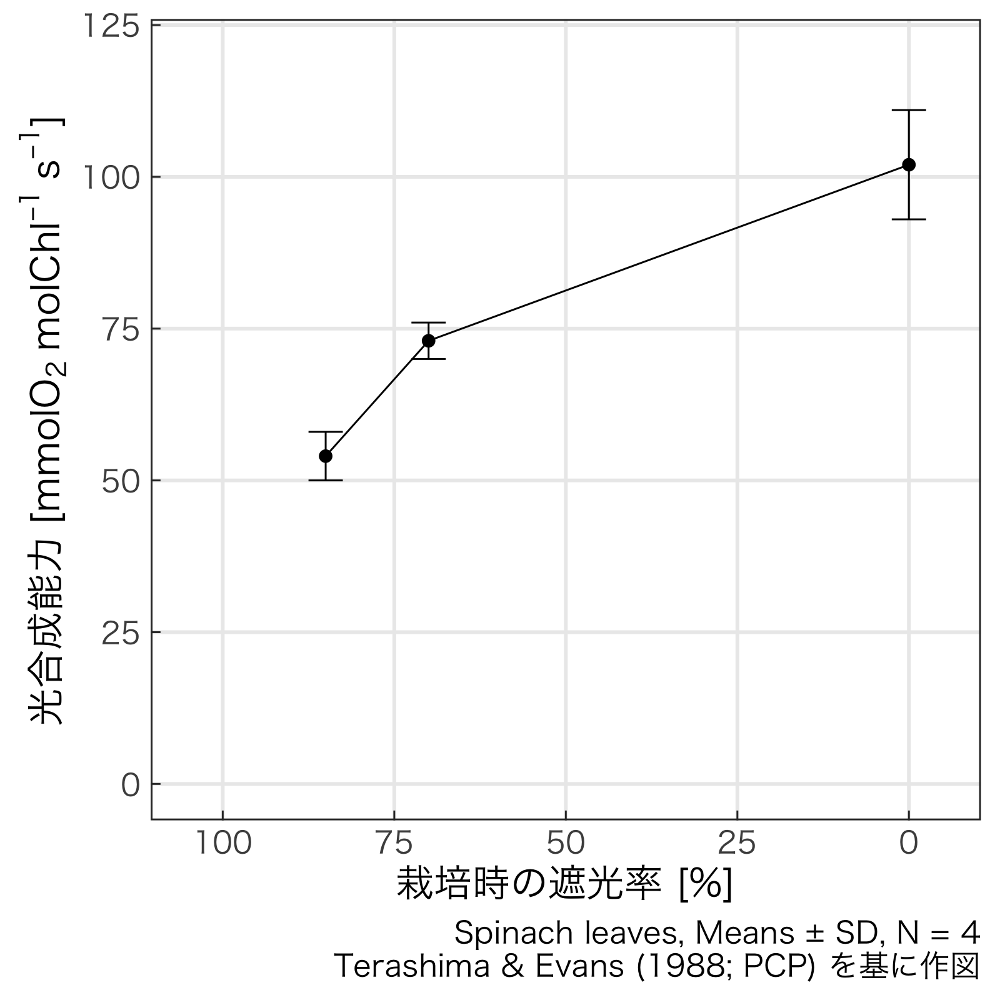
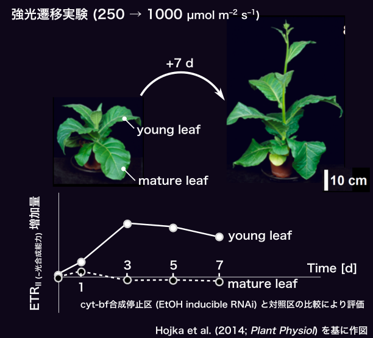
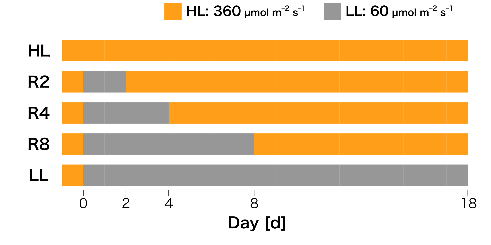
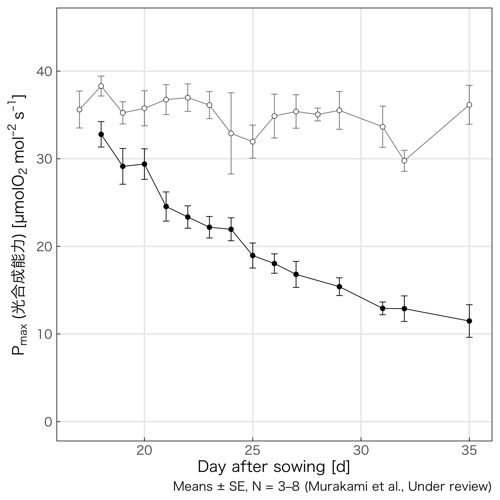
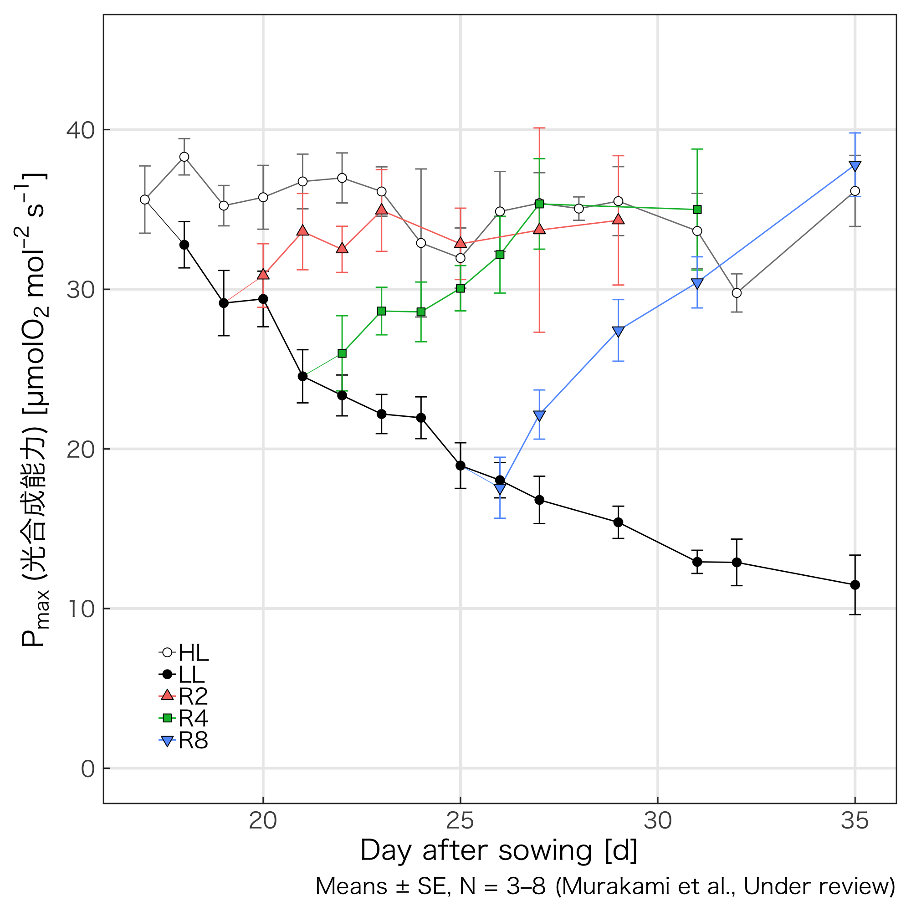
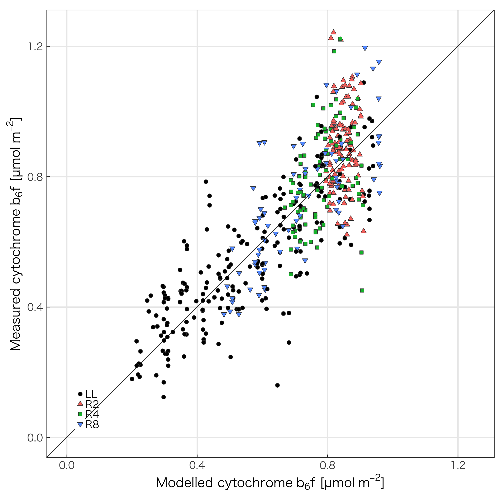
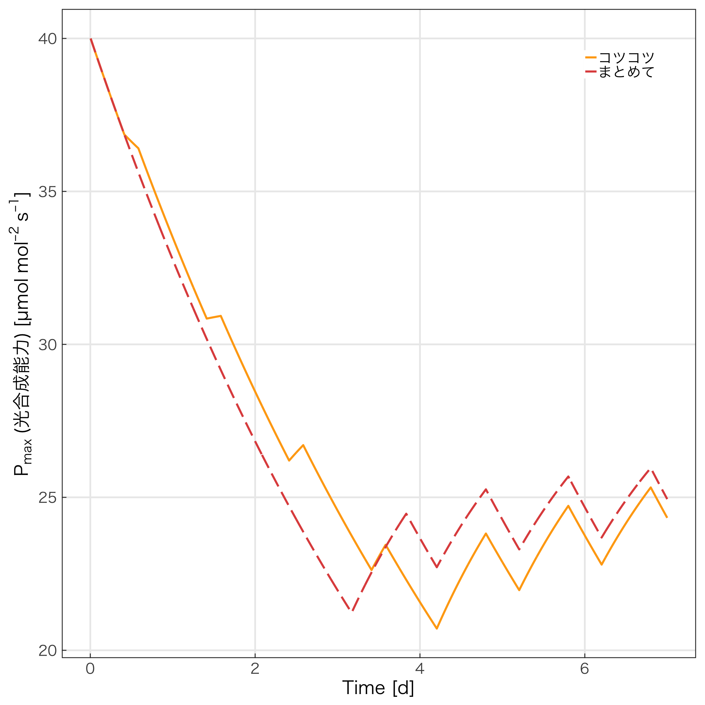

<script type="text/javascript"
  src="https://cdnjs.cloudflare.com/ajax/libs/mathjax/2.7.0/MathJax.js?config=TeX-AMS-MML_HTMLorMML">
</script>

<!--html_preserve--><div style='position:absolute; left:-50%; width:200%; top:550px; height:80px; padding:10px; font-size:0.5em; text-align:center; background-color:grey; color:white'><!--/html_preserve-->

日本農業気象学会2019年 (草薙キャンパス, 静岡県立大学)<br>
This slide is available: <!--html_preserve-->@fa[github]<!--/html_preserve--> `KeachMurakami/AgrMet2019`
</div>

<br>
<br>

**成熟した葉の光合成能力は強光順化応答を示さないのか**

<br>
<br>

<div style="text-align:right">
<span style="color:orange">村上 貴一<sup>1,2</sup></span>, Wah Soon Chow<sup>1</sup><br>(<sup>1</sup>The Australian National University, <sup>2</sup>山口大学)
</div style="text-align:right">

---?color=linear-gradient(to left, #88ccf2, #aae7ed)

## Introduction

+++

光合成能力 = 光・CO<sub>2</sub>飽和条件下での総光合成速度


<div class="left">

</div class="left">

<div class="right">
<br>
<br>
@ul
- <small>強光下では高い方が有利</small>
- <small><orange>cytochrome *b*<sub>6</sub>*f* (cyt-bf) 量</orange>と正の相関 (Evans 1988など)</small>
@ulend
</div class="left">

+++

強光下で<span class="fragment highlight-blue">育てば</span>光合成能力が高くなる (**強光順化**)


<p style="text-align:center;"></p>

<p class = "fragment" style="text-align:center;">展開を終えた葉 = **成熟葉**ではどうか？</p>

+++

葉の寿命は長い

成熟葉の柔軟な強光順化は**葉の生涯の‘稼ぎ’**に大きな影響を及ぼすのでは？

+++

成熟葉の順化に着目した文献

<div class="column1" style="font-size: 0.5em">
受光量の低下に応じて速やかにcyt-bfが分解される

</div class = "column1">


<div class = "column2" style="font-size: 0.5em">
cyt-bfが新たに合成されず強光順化できない

</div class = "column2">

<p class="fragment" style="text-align:center;"><orange>数日の曇りで光合成能力が不可逆的に低下する？</orange></p>

+++

<br>
<br>
**Q. 成熟葉は強光順化しないのか？**
<br>
<br>
<br>
<div style="position:relative; left:10px">
@ul
- 予想: 成熟後、徐々に順化柔軟性が失われる
- 実験: 成熟葉に対して強光 → 数日の弱光 → 再強光
- 手法: 弱光日数が回復過程に及ぼす影響をモデル化
@ulend
</div>

---?color=linear-gradient(to left, #ccddee, #aabbcc)

## Materials & Methods

+++

供試植物


+++

試験区



+++

測定項目

<div style="position:relative; left:10px">
<br>
- <small>光合成能力</small>
  - <small>CO<sub>2</sub>濃度1%、飽和光 (白色LED, 2000 µmol m<sup>-2</sup> s<sup>-1</sup>) での総酸素発生速度</small>
- <small>functionalなPSII量</small>
  - <small>PSIIが飽和閃光４回ごとに１回酸素発生するという仮定 <small>(Chow et al. 1991; Aust J Plant Physiol)</small></small>
- <small>cyt-bf量</small>
  - <small>光合成能力・functionalなPSII量から、経験式に従って算出 <small>(Dwyer et al. 2012; JXB)</small></small>

</div style="position:relative; left:25px">

---?color=linear-gradient(to left, #88ccf2, #aae7ed)

## Results & Discussion

+++


**結果１: 光合成能力の推移**

<div class="column1">

</div class="left">

<div class="column2">
@ul
- <small>HL:<br>処理開始から光合成能力が概ね一定<br> → 成熟葉</small>
- <small>LL:<br>処理開始以降、指数関数的減衰<br> → 濃度依存的な分解 (一次反応)</small>
@ulend
</div class="left">

+++

**結果１: 光合成能力の推移**

<div class="column1">

</div class="left">

<div class="column2">
@ul
- <small>R2, R4, R8:<br>再強光処理で上昇 <br>→ **強光順化**</small>
@ulend
</div class="right">

+++


**結果２: cyt-bf量の推移**

<div class="column1">

</div class="left">

<div class="column2">
@ul
- <small>P<sub>max</sub>と同様の傾向<br> → PSII量は光合成能力を律速しない <small>(Dwyer et al. 2012; JXB)</small></small>
- <small>**成熟葉内でもcyt-bfが合成された？**</small>
@ulend
</div class="right">

<!-- +++ -->

<!-- ```{r recovery} -->
<!-- list_figure$recovery + -->
<!--   labs(caption = "Means ± SE, N = 2–8 (Murakami et al., Under review)") -->
<!-- ``` -->

<!-- **結果２: cyt-bf量の推移** -->

<!--  -->

<!-- @ul -->
<!-- - <small>R8でやや回復開始が遅れる傾向があるものの、大差なしか？</small> -->
<!-- @ulend -->

+++

**結果３: cyt-bf分解・合成特性の解析**

<div style="font-size: 0.5em">
`\[
\frac{dy}{dt} = y - k_\textrm{d} \cdot y + k_\textrm{r} \cdot (y_\textrm{steady} - y)
\]`
</div style="font-size: 0.5em">


<div class="fragment">
<div class="column1">

</div>

<div class="column2">
@ul
- <small>*k*<sub>d</sub>が分解速度、*k*<sub>r</sub>が合成速度、*y*<sub>steady</sub>が定常値に関係</small>
- <small>`Stan`+`R` で統計モデリング</small>
@ulend
</div>
</div class="fragment">

+++

<!-- **結果３: cyt-bf分解・合成特性の解析 (モデル vs 実測)** -->

<!--  -->

<!-- +++ -->

**結果３: cyt-bf分解・合成特性の解析**

<div style="position:relative; left:0px; top:10%; width:100%; height:800px">
  <div style="position:absolute; left:0px; top:0px; width:100%; height:100%">
    
  </div>
  <div class = "fragment" style="position:absolute; left:0px; top:0px; width:100%; height:100%">
    
  </div>
</div>

+++

**結果３: cyt-bf分解・合成特性の解析**

<div style="font-size: 0.5em">
`\[
\frac{dy}{dt} = y - k_\textrm{d} \cdot y + k_\textrm{r} \cdot (y_\textrm{steady} - y)
\]`
</div style="font-size: 0.5em">


<div class="left">

</div class="left">

<div class="right">
@ul
- <small>顕著な試験区間差はなし<br>(半減期換算でおよそ14–17日の範囲)</small>
- <small>弱光処理期間が長いほど<br>むしろ回復が速い？</small>
@ulend
</div class="right">

+++

**Ontogenetic repression of cyt-bf biogenesis in mature leaves—Hojka et al. (2014), Schöttler et al. (2015)**

@ul
- ‘... under high-light conditions, all plants suffered from moderate oxidative stress’
- **強光阻害でcyt-bf修復が妨げられただけでは...？**
    - cyt-bfのサブユニット (PetD) はPSIIのD1と同じくらい高速で分解・修復されているらしい (電子伝達流量コントローラ？) <small>(Li et al. 2018, *Trend Plant Sci*)</small>
@ulend


+++

**補光シミュレーション: コツコツ vs まとめて**

<div class="left">
<div class="fragment">

</div class="fragment">
</div class="left">

<div class="right" style="line-height: 0.9">
<div class="fragment">
- <small>個体に成熟葉が１枚だけ</small>
- <small>ON/OFF制御 300 µmol m<sup>-2</sup> s<sup>-1</sup>の補光設備</small>
- <small>PPFD 300 µmol m<sup>-2</sup> s<sup>-1</sup> で回復項 (*k*<sub>r</sub>) ありなしが切り替わり</small>
- <small>非直角双曲線型の光ー光合成曲線 <small>(初期勾配 = 0.05, 凸度 = 0.80, 暗呼吸速度 = 光合成能力/10)</small></small>
- <small>常にCO<sub>2</sub>飽和条件</small>
</div class="fragment">
</div class="right" style="font-size: 0.5em">

+++

<div class="column1">

</div class="column1">

<div class="column2">

</div class="column2">

---?color=linear-gradient(to left, #88ccf2, #aae7ed)

## Summary

+++

<div style="position:relative; left:10px">

@ul
- **Q. 成熟した葉の光合成能力は強光順化応答を示さないのか**
    - **A. 示す**
- Cytochrome *b*<sub>6</sub>*f*は成熟した葉でも合成されるらしい
- １週間程度の弱光処理であれば、再上昇時の時間的特性に著しい影響を及ぼすことはなさそう
- 環境調節の意思決定では近い将来まで考慮するべきでは？
@ulend
</div style="position:relative; left:10px">

<!--html_preserve--><div style='position:absolute; left:-50%; width:200%; top:550px; height:70px; padding:10px; font-size:0.5em; text-align:center; background-color:grey; color:white'><!--/html_preserve-->
This work was supported by JSPS KAKENHI (Grant Number 17J04736)  
‘個体光合成量の制御と予測のための個葉の光合成特性の経時推移モデルの開発’
</div>


---?color=linear-gradient(to left, #56ccf2, #2f80ed)

### Appendix

+++

<div style="position:relative; left:10px">

**新出葉・隣接個体からの遮蔽は？**  

<small>**若干はあり**。ただし主茎カット区の光合成能力がHL区と概ね同様なのでマイナー。</small>

</div>


+++


**モデルの妥当性は？**

<div style="position:relative; left:10px; font-size: 0.6em">

- 悩ましい。
    - R8の回復開始の遅れを反映する狙いで、ロジスティック曲線も試したが、<br>統計モデルの収束に難あり。
    - 一般化するなら完全に再順化能を失うまで弱光日数を伸ばす必要がある。
        - R17までは試してみたところ、ややヘタれるものの強光順化可能。
    - <small>はっきり言えそうなのは、<br>「1週間程度の弱光であれば、光合成能力の順化の柔軟性を**極端に**損ねることはなさそう」ということ</small>

</div>

<!-- +++ -->

<!-- <div style="position:relative; left:25px"> -->


<!-- **強光ストレスをもう少し具体的に**   -->

<!-- - <small>**cyt-bfのサブユニットのターンオーバー阻害では？**</small> -->
<!--     - <small>cyt-bfのPetDというサブユニットは、損傷・回復の顕著なPSIIのD1サブユニットと類似点が多い (Li et al. 2018; Trend Plant Sci) -->
<!--     - <small>D1は活性酸素により修復が止まる (Nishiyama et al. ; )</small> -->
<!-- </div> -->


