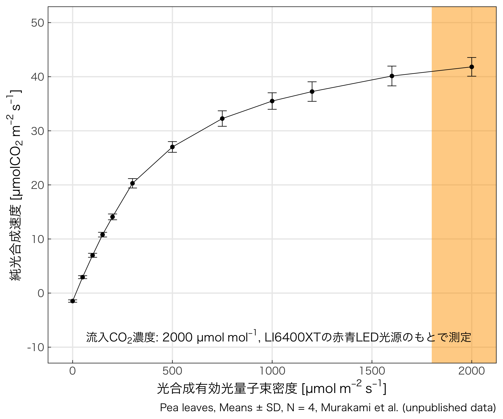
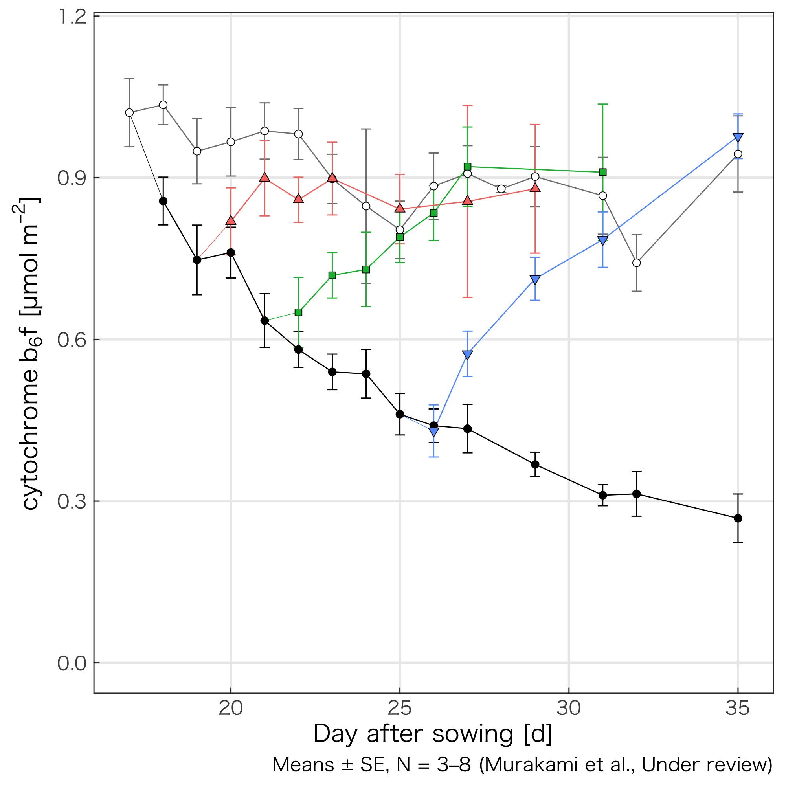
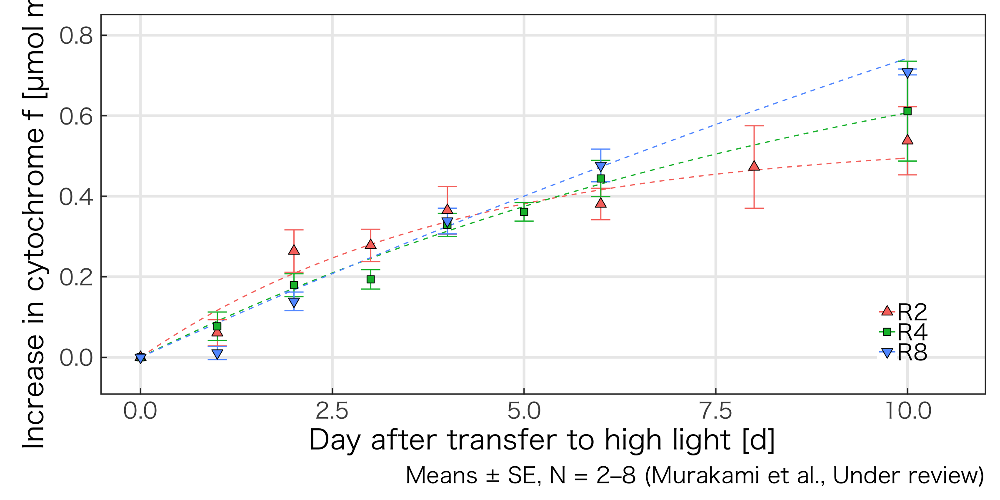
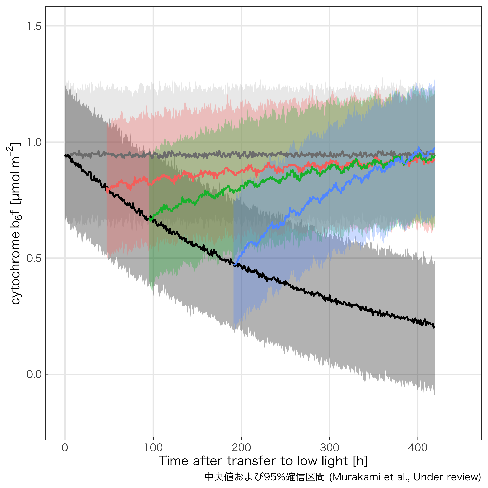
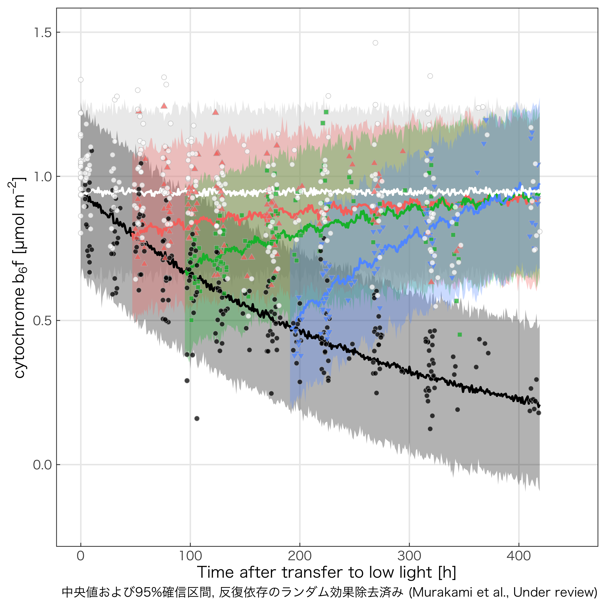

<!--html_preserve-->
<!--/html_preserve-->

日本農業気象学会2019年 (草薙キャンパス, 静岡県立大学) 
This slide is available on <!--html_preserve-->@fa[github]<!--/html_preserve--> `KeachMurakami/AgrMet2019`

 
 

**成熟した葉の光合成能力は強光順化応答を示さないのか**

 
 

村上 貴一1,2, Wah Soon Chow1 (1The Australian National University, 2山口大学)

---?color=linear-gradient(to left, #56ccf2, #2f80ed)
<!-- .slide: class="center" -->

## Introduction

+++

光合成能力 = 光・CO2飽和条件下での総光合成速度

- 強光下では高い方が有利
- Cytochrome *b*6*f*量と正の相関

+++

強光下で育てば光合成能力が高くなる (強光順化)

**成熟葉ではどうか？**

+++

葉の寿命は長い

成熟後の光合成機能の柔軟さは**葉の生涯の‘稼ぎ’**に大きな影響を及ぼす

+++

成熟葉の順化能力に関する知見

成熟葉では受光量の低下に応じて速やかにcyt-bfが分解される (Zhu et al. 2016)

成熟葉ではcyt-bfは新たに合成されず、強光順化しない (Hojka et al. 2014)

**数日の曇りで光合成能力が不可逆的に低下する？**

+++

**Q: 成熟葉は強光順化しないのか？**

- 成熟葉に対して強光 -> 数日の弱光 -> 強光
- 弱光処理の長さは順化の時間的特性に影響する

---?color=linear-gradient(to left, #88ccf2, #aae7ed)

## Materials & Methods

+++

供試植物

エンドウ (*Pisum sativum*, ‘Greenfeast’)

+++

試験区

+++

測定項目

- <small>光合成能力</small>
  - <small>CO2濃度1%、飽和光 (白色LED, 2000 µmol m-2 s-1) での総酸素発生速度</small>
- <small>functionalなPSII量</small>
  - <small>PSIIが飽和閃光４回ごとに１回酸素発生するという仮定 (Chow et al. 1991)</small>
- <small>cyto-bf量</small>
  - <small>光合成能力・functionalなPSII量から、経験式 (Dwyer et al. 2012) に従って算出</small>

---?color=linear-gradient(to left, #88ccf2, #aae7ed)

### 結果および考察

+++

**結果１: 光合成能力の推移**

- <small>HL: 処理開始から光合成能力が概ね一定 -> 成熟葉</small>
- <small>LL: 処理開始以降、指数関数的減衰 -> １次反応っぽい</small>

+++

**結果１: 光合成能力の推移**

- <small>R2, R4, R8: 再強光処理で上昇 -> **強光順化**</small>

+++

**結果２: cyt-bfの推移**

- <small>Pmaxと同様の傾向 → PSII量は光合成能力を律速していない (Dwyer et al. 2012と同様)</small>
- <small>**再強光処理により、成熟葉内でもcyt-bfが合成された？**</small>

+++

**結果２: cyt-bf量の推移**

- <small>R8でやや回復開始が遅れる傾向があるものの、大差なしか？</small>

+++

**結果３: 統計モデリングによるcyt-bf合成の時間的特性解析**

`\[
\frac{dy}{dt} = y - k_\textrm{d} \cdot y + k_\textrm{r} \cdot (y_\textrm{steady} - y)
\]`

+++

**結果３: 統計モデリングによるcyt-bf分解・合成特性の解析**

`\[
\frac{dy}{dt} = y - k_\textrm{d} \cdot y + k_\textrm{r} \cdot (y_\textrm{steady} - y)
\]`

- <small>*k*dが分解速度、*k*rが合成速度、*P*steadyが順化後の定常値に関係</small>
- <small>`Stan`+`R` で統計モデリング</small>

+++

**結果３: 統計モデリングによるcyt-bf分解・合成特性の解析**

  

    
  

  

    
  

+++

**結果３: 統計モデリングによるcyt-bf分解・合成特性の解析**

`\[
\frac{dy}{dt} = y - k_\textrm{d} \cdot y + k_\textrm{r} \cdot (y_\textrm{steady} - y)
\]`

- <small>顕著な試験区間差はなさそう (半減期換算で、およそ14--17日の範囲)</small>
- <small>むしろ弱光処理期間が長いほど回復が速まる？</small>

+++

#### 「成熟葉で強光順化なし」？

<!-- > ‘strong ontogenitc repression of cyt-bf complex biogenesis in fully expanded leaves’---Schöttler et al. (2015) -->
<small>‘switch-off of cytochrome *b*6*f* complex biogenesis in mature leaves’---Hojka et al. (2014)</small>

<small>‘... under high-light conditions, all plants suffered from moderate oxidative stress’</small>

ただの強光ストレス？

+++

#### シミュレーション: 毎日コツコツ vs 一気にまとめて

- <small>成熟葉が１枚だけ着いた個体</small>
- <small>１週間先までの受光量は既知 (４日間曇り → ３日間晴れ)</small>
- <small>300 µmol m-2 s-1 ON/OFF制御の補光設備</small>
- <small>PPFD 300 µmol m-2 s-1 を閾値に、回復項 (*k*r) がありなしで切り替え (中間なし)</small>

![img/compare_schemes.png]

+++

- <small>CO2飽和条件</small>
- <small>光-光合成曲線は非直角双曲線 (初期勾配 = 0.05, 凸度 = 0.80, 暗呼吸速度 = Pmax/10)</small>
- <small>暗呼吸速度はPmaxに比例</small>

---?color=linear-gradient(to left, #88ccf2, #aae7ed)

### まとめ

+++

@ul
- 成熟した葉の光合成能力は強光順化応答を示さないのか
    - **示す。**
- Cytochrome *b*6*f*は成熟した葉でも蓄積されるらしい
- １週間程度の弱光処理であれば、再上昇時の時間的特性に著しい影響を及ぼすことはなさそう
- 環境調節の意思決定では近い将来まで考慮するべきでは？
@ulend

<!--html_preserve-->
<!--/html_preserve-->
This work was supported by JSPS KAKENHI (Grant Number 17J04736 to K.M.) 
Contact: Keach Murakami (keach.murakami@gmail.com)

---?color=linear-gradient(to left, #56ccf2, #2f80ed)

### Appendix

+++

**新出葉・隣接個体からの遮蔽は？**  

- <small>**若干はあります**</small>
- <small>ただし、主茎カット処理区の光合成能力はHL区とおおむね同様</small>

+++

**モデルの妥当性は？**  

- <small>**悩ましい**</small>
- <small>ロジスティック曲線も試してみました</small>
  - <small>R8の立ち上がりの遅れを反映する狙い</small>
  - <small>モデルの収束に難あり</small>
- <small>1週間程度の弱光であれば、 光合成能力の順化の柔軟性を**極端に**損ねることはなさそう</small>

+++

**強光ストレスをもう少し具体的に**  

- <small>**cyt-bfのサブユニットのターンオーバー阻害では？**</small>
    - <small>cyt-bfのPetDというサブユニットは、損傷・回復の顕著なPSIIのD1サブユニットと類似点が多い (Li et al. 2018; Trend Plant Sci)
    - <small>D1は活性酸素により修復が止まる (Nishiyama et al. ; )</small>

